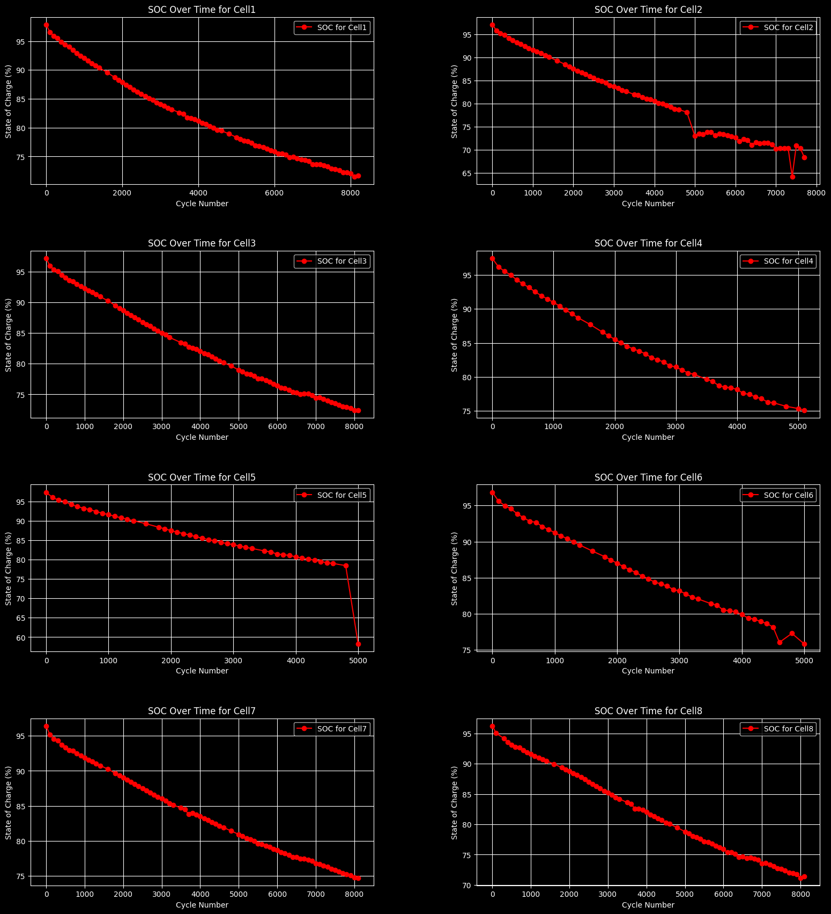

# Oxford Battery Degradation Analysis

This project analyzes the Oxford Battery Degradation Dataset using various machine learning techniques to predict battery capacity degradation. The steps include data loading, preprocessing, exploratory data analysis, feature engineering, model training, hyperparameter tuning, and a theoretical deployment plan using KServe in a Kubeflow environment.

## Table of Contents

- [Introduction](#introduction)
- [Dataset](#dataset)
- [Installation](#installation)
- [Usage](#usage)
- [Data Preprocessing](#data-preprocessing)
- [Exploratory Data Analysis](#exploratory-data-analysis)
- [Feature Engineering](#feature-engineering)
- [Model Training](#model-training)
- [Hyperparameter Tuning](#hyperparameter-tuning)
- [Model Evaluation](#model-evaluation)
- [Deployment Plan](#deployment-plan)
- [Contributing](#contributing)

## Introduction

This project aims to predict the degradation of battery capacity over time using the Oxford Battery Degradation Dataset. The dataset contains information on battery cycles, and the analysis involves training a machine learning model to predict capacity degradation.

## Dataset

The Oxford Battery Degradation Dataset is used in this project. It includes data on various battery cycles and their corresponding capacities. The dataset is preprocessed and normalized to extract meaningful features for the machine learning model.

## Installation

To run this project, you need to have Python 3.10 and the following libraries installed:

- pandas
- numpy
- matplotlib
- seaborn
- scikit-learn
- lightgbm
- kubeflow

You can install the required libraries using the following command:

```bash
pip install pandas numpy matplotlib seaborn scikit-learn lightgbm
```

## Usage

1. Clone the repository:

```bash
git clone https://github.com/nitish20899/Oxford-Lithium-Ion-Battery-SOC-prediction-AI.git
cd Oxford-Lithium-Ion-Battery-SOC-prediction-AI
```

2. Run the Jupyter notebook:

```bash
jupyter notebook Oxford_battery_analysis.ipynb
```

## Data Preprocessing

The data preprocessing step involves loading the dataset, normalizing the data, and extracting relevant features. The following steps are performed:

- Loading the dataset
- Normalizing the data
- Feature extraction

## Exploratory Data Analysis

Exploratory Data Analysis (EDA) is performed to understand the underlying patterns in the data. Various plots are used to visualize the data, including:

- Histograms
- Scatter plots
- Line plots

### EDA Images




## Feature Engineering

Feature engineering is performed to extract meaningful features from the dataset. Domain-specific knowledge is used to create new features that are relevant for predicting battery capacity degradation.

## Model Training

The data is split into training and test sets, and a machine learning model (e.g., LightGBM) is trained on the data. The model is evaluated using metrics like Mean Absolute Error (MAE).

## Hyperparameter Tuning

Hyperparameter tuning is performed using techniques like GridSearchCV to find the best hyperparameters for the model.

## Model Evaluation

The final model is evaluated on the test set, and the results are analyzed using various plots and metrics.

### Model Prediction


## Deployment Plan

A theoretical deployment plan is outlined for deploying the model using KServe in a Kubeflow environment. The steps include:

- Setting up training and inference pipelines in Kubeflow
- Training the model as needed
- Saving the model to a Persistent Volume Claim (PVC) or an S3 bucket
- Creating a Docker container to serve the model
- Deploying the model using KServe
- Handling prediction requests from the service's endpoint

## Contributing

Contributions are welcome! Please open an issue or submit a pull request for any changes.
